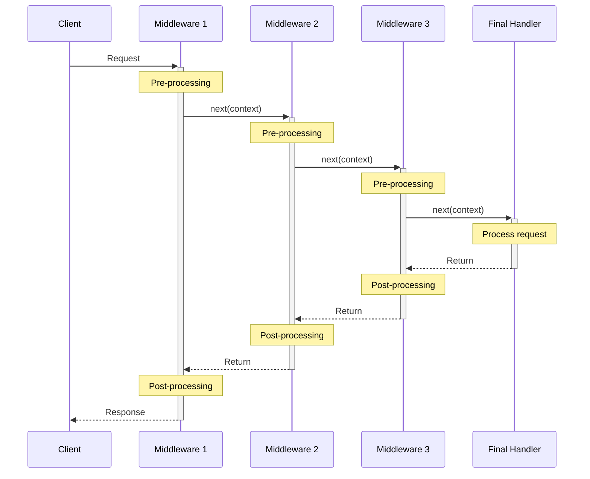

## Build Status
[](https://github.com/marklauter/plumber/actions/workflows/dotnet.tests.yml)
[](https://github.com/marklauter/plumber/actions/workflows/dotnet.publish.yml)
[](https://www.nuget.org/packages/MSL.Plumber.Pipeline/)
[](https://dotnet.microsoft.com/en-us/download/dotnet/8.0/)

## 


# Plumber
## Middleware pipelines for host-free projects like AWS Lambda, Console, etc.
Plumber is a C# library for dotnet that provides a generic middleware pipeline framework for applications that don't have a built-in host, such as AWS Lambda functions, console applications, queue event handlers, and similar scenarios. It implements a request-response pattern with support for middleware functions and components, dependency injection, and configuration management.

## Table of Contents
- [Use Cases](#middleware-pipeline-use-cases)
- [References](#references)
- [Prerequisites](#prerequisites)
- [Installation](#installation)
- [Getting Started](#getting-started)
  - [Basic Setup](#basic-setup)
  - [Configuration](#configuration)
  - [Service Registration](#service-registration)
  - [Middleware Implementation](#middleware-implementation)
- [Pipeline Architecture](#pipeline-architecture)
- [Examples](#examples)
  - [Simple Example](#simplest-example---no-config-no-services-no-middleware)
  - [Middleware Delegate Example](#middleware-delegate-example)
  - [Middleware Class Example](#middleware-class-example)
  - [Configuration Example](#builder-configuration-example)
  - [Service Registration Example](#builder-service-registration-example)
- [Sample Projects](#sample-aws-lambda-projects)
- [Advanced Techniques](#advanced-techniques)
  - [Error Handling](#error-handling)
  - [Request Timeout](#request-timeout)
  - [Middleware Data Sharing](#middleware-data-sharing)
  - [Pipeline Short-Circuiting](#pipeline-short-circuiting)
  - [Response Handling](#response-handling)
  - [Using Void Response Type](#using-void-response-type)
- [Frequently Asked Questions (FAQ)](#frequently-asked-questions-faq)

## Middleware Pipeline Use Cases
Plumber is well-suited for various scenarios:

### Console Applications
- CLI tools with complex processing steps
- Batch processing applications
- Data migration tools
- System maintenance utilities

### AWS Lambda Functions
- Functions requiring dependency injection services
- API Gateway request processing
- event handlers (SQS, SNS, DynamoDB Streams, CDC, etc)

### Message Queue Processing
- RabbitMQ consumer applications
- Azure Service Bus message handlers
- Apache Kafka consumers
- Custom message broker integrations

### File Processing Pipelines
- Document conversion workflows
- Image processing pipelines
- ETL (Extract, Transform, Load) operations
- Batch file processing systems

### API Integrations
- Third-party API middleware
- Webhook handlers
- API gateway transformations
- Microservice communication layers

## References
Plumber is based on this article:
[How is the ASP.NET Core Middleware Pipeline Built - Steve Gorden, July 2020](https://www.stevejgordon.co.uk/how-is-the-asp-net-core-middleware-pipeline-built)

## Prerequisites
- .NET 8.0 SDK or later
- For AWS Lambda samples:
  - AWS account with appropriate permissions
  - AWS CLI installed and configured
  - Amazon.Lambda.Tools Global Tool (instructions in sample projects)

## Installation
You can install the Plumber package using any of the following methods:

### Using .NET CLI
```bash
dotnet add package MSL.Plumber.Pipeline
```

### Using Package Manager Console
```powershell
Install-Package MSL.Plumber.Pipeline
```

### Using PackageReference in .csproj file
```xml
<PackageReference Include="MSL.Plumber.Pipeline" Version="2.3.2" />
```

## Getting Started
If you're not familiar with middleware pipelines, Microsoft has a [good primer on how middleware works in ASP.NET Core](https://learn.microsoft.com/en-us/aspnet/core/fundamentals/middleware/?view=aspnetcore-8.0).

### Basic Setup
Here's the basic flow for setting up and using a Plumber pipeline:

1. Create a request handler builder
2. Configure services and settings
3. Build the request handler
4. Add middleware components
5. Invoke the pipeline with a request

```csharp
// 1. Create a builder
var builder = RequestHandlerBuilder.Create<MyRequest, MyResponse>(args);

// 2. Register services
builder.Services.AddSingleton<IMyService, MyService>();

// 3. Build the handler
var handler = builder.Build();

// 4. Add middleware
handler.Use<ValidationMiddleware>()
    .Use<ProcessingMiddleware>()
    .Use<LoggingMiddleware>();

// 5. Invoke the pipeline
var response = await handler.InvokeAsync(request);
```

### Configuration
Plumber supports various configuration approaches:

1. Create a builder with default configuration providers:
```csharp
// Automatically includes appsettings.json, environment variables, and command line args
var builder = RequestHandlerBuilder.Create<TRequest, TResponse>(args);
```

2. Create a builder with custom configuration:
```csharp
var builder = RequestHandlerBuilder.Create<TRequest, TResponse>(args, (configuration, args) => 
{
    configuration.AddJsonFile("custom-settings.json")
                .AddEnvironmentVariables("APP_");
});
```

3. Add additional configuration after creation:
```csharp
builder.Configuration.AddInMemoryCollection(new Dictionary<string, string> 
{
    { "Logging:LogLevel:Default", "Information" },
    { "RequestTimeout", "00:00:30" }
});
```

### Service Registration
Register services using the standard Microsoft.Extensions.DependencyInjection patterns:

```csharp
builder.Services
    .AddSingleton<IMyService, MyService>()
    .AddScoped<ITransientService, TransientService>()
    .AddTransient<IScopedService, ScopedService>();
```

### Middleware Implementation
Middleware components can be implemented in two ways:

1. As delegates:
```csharp
handler.Use(async (context, next) =>
{
    // Pre-processing
    context.CancellationToken.ThrowIfCancellationRequested();
    
    // Do something with the request
    var modifiedRequest = ProcessRequest(context.Request);
    
    // Call the next middleware
    await next(context);
    
    // Post-processing (after all subsequent middleware have executed)
    if (context.Response != null)
    {
        context.Response = EnhanceResponse(context.Response);
    }
});
```

2. As classes:
```csharp
public sealed class LoggingMiddleware(RequestMiddleware<TRequest, TResponse> next, ILogger<LoggingMiddleware> logger)
{
    public async Task InvokeAsync(RequestContext<TRequest, TResponse> context)
    {
        context.CancellationToken.ThrowIfCancellationRequested();
        
        logger.LogInformation("Processing request {Id}", context.Id);
        var stopwatch = Stopwatch.StartNew();
        
        try
        {
            await next(context);
        }
        finally
        {
            stopwatch.Stop();
            logger.LogInformation("Request {Id} completed in {ElapsedMs}ms", 
                context.Id, stopwatch.ElapsedMilliseconds);
        }
    }
}
```

## Pipeline Architecture
Plumber's pipeline works similar to ASP.NET Core's middleware pipeline but is designed for non-host environments:

1. **Request Flow**: When `InvokeAsync` is called, a request context is created and passed through each middleware in sequence.

2. **Middleware Execution Order**: Middleware components are executed in the order they are added to the pipeline, but they are built in reverse order (similar to a stack).

3. **Service Lifetime**: Each request gets its own scoped service provider, ensuring proper lifetime management of your services.

4. **Request Context**: The `RequestContext<TRequest, TResponse>` contains everything needed for processing:
   - The original request
   - A slot for the response
   - A unique request ID for tracing
   - Timestamp for measuring elapsed time
   - Service provider for dependency injection
   - Cancellation token for timeout handling
   - Data dictionary for sharing state between middleware

### Middleware Execution Order

It's essential to understand the execution flow of middleware in the pipeline:

1. Middleware is executed in the order they are added to the pipeline using the `Use` methods
2. Code before the `await next(context)` call runs in the registration order (first to last)
3. Code after the `await next(context)` call runs in reverse order (last to first)

This creates a nested structure similar to an onion, where the request travels inward through each layer, and then the response travels outward in the reverse order.



The execution flow demonstrates how:

1. Pre-processing code runs in registration order (MW1 → MW2 → MW3)
2. The final handler processes the core request logic
3. Post-processing code runs in reverse order (MW3 → MW2 → MW1)
4. Each middleware can modify both the request (on the way in) and the response (on the way out)

Alternatively, here's a simplified representation of the execution flow:

```
Request → Middleware 1 (Pre) → Middleware 2 (Pre) → Middleware 3 (Pre) → Final Handler
                                                           ↓
Response ← Middleware 1 (Post) ← Middleware 2 (Post) ← Middleware 3 (Post)
```

Here's how the execution flows in a simple example with three middleware components:

```csharp
handler.Use(async (context, next) =>
{
    // 1. First pre-processing
    Console.WriteLine("1. First middleware - Pre-processing");
    
    await next(context);
    
    // 6. First post-processing (runs last)
    Console.WriteLine("6. First middleware - Post-processing");
});

handler.Use(async (context, next) =>
{
    // 2. Second pre-processing
    Console.WriteLine("2. Second middleware - Pre-processing");
    
    await next(context);
    
    // 5. Second post-processing
    Console.WriteLine("5. Second middleware - Post-processing");
});

handler.Use(async (context, next) =>
{
    // 3. Third pre-processing
    Console.WriteLine("3. Third middleware - Pre-processing");
    
    await next(context);
    
    // 4. Third post-processing (runs first)
    Console.WriteLine("4. Third middleware - Post-processing");
});
```

Understanding this execution pattern is crucial when designing middleware that needs to transform requests before later middleware components process them, or transform responses after earlier middleware has processed them.

## Examples
The following examples demonstrate common usage scenarios.

### Simplest Example - no config, no services, no middleware
In this sample, we create a request handler that does nothing with no configuration, no service registration, and no user-defined middleware. This is the simplest possible example.
```csharp
var request = "Hello, World!";

var handler = RequestHandlerBuilder
    .Create<string, string>()
    .Build();

var response = await handler.InvokeAsync(request);

Assert.True(string.IsNullOrEmpty(response));
```

### Middleware Delegate Example
In this sample, we create a request handler with user-defined middleware that converts the request to uppercase.
```csharp
var request = "Hello, World!";

var handler = RequestHandlerBuilder.Create<string, string>()
    .Build()
    .Use(async (context, next) =>
    {
        context.CancellationToken.ThrowIfCancellationRequested();
        context.Response = context.Request.ToUpperInvariant();
        await next(context); // call next to pass the request context to the next delegate in the pipeline
    });

var response = await handler.InvokeAsync(request);

Assert.Equal(request.ToUpperInvariant(), response);
```

### Middleware Class Example
In this sample, we create a request handler with a user-defined middleware class that converts the request to lowercase.

First, we define the middleware class, which receives the next middleware delegate in the pipeline in its constructor.
The middleware is responsible for invoking the `next` delegate. You will short-circuit the pipeline if you don't invoke the `next` delegate.
An example short-circuit scenario might be a request validation middleware that returns an error response if the request is invalid. 
The middleware is also responsible for short-circuiting when the pipeline is explicitly canceled via the `context.CancellationToken`.

Constructor-based dependency injection is supported for middleware implementations, 
with the condition that the `next` delegate must be the first argument in the constructor.
```csharp
internal sealed class ToLowerMiddleware(RequestMiddleware<string, string> next)
{
    public Task InvokeAsync(RequestContext<string, string> context)
    {
        context.CancellationToken.ThrowIfCancellationRequested();
        context.Response = context.Request.ToLowerInvariant();

        // call next to pass the request context to the next delegate in the pipeline
        return next(context);
    }
}
```

`InvokeAsync` dependency injection is supported for middleware implementations, 
with the condition that the `RequestContext<TRequest, TResponse>` must be the first argument.
```csharp
internal sealed class ToLowerMiddleware(RequestMiddleware<string, string> next)
{
    public Task InvokeAsync(
        RequestContext<string, string> context, // context is first argument
        IMyFavoriteService service) // second argument is injected by the pipeline's service scope
    {
        context.CancellationToken.ThrowIfCancellationRequested();
        context.Response = service.DoSomethingWonderful(context.Request.ToLowerInvariant());

        // call next to pass the request context to the next delegate in the pipeline
        return next(context); 
    }
}
```

Next, we register the middleware with the request handler with the `Use<T>` method.
```csharp
var request = "Hello, World!";

var handler = RequestHandlerBuilder.Create<string, string>()
    .Build()
    .Use<ToLowerMiddleware>();

var response = await handler.InvokeAsync(request);

Assert.Equal(request.ToLowerInvariant(), response);
```

### Builder Configuration Example
Use the `IRequestHandlerBuilder.Configuration` property to add configuration providers, like `AddInMemory` or `AddJsonFile`.
```csharp
// default configuration providers are added in order
// 1. optional appsettings.json
// 2. optional appsettings.{env}.json
// 3. environment variables
// 4. if dev env, then user secrets
// 5. command line args
var builder = RequestHandlerBuilder.Create<string, string>(args);

// extra configuration providers can be added
builder.Configuration.AddInMemoryCollection(new Dictionary<string, string> { { "MyKey", "MyValue" } });

var handler = builder.Build();
```
Provide your own set of configuration providers with the `Create` method.
```csharp
// only user specified configuration providers are added
var builder = RequestHandlerBuilder.Create<string, string>(args, (configuration, args) => 
{
    configuration.AddJsonFile("mysettings.json");
});
```

### Builder Service Registration Example
Use the `IRequestHandlerBuilder.Services` property to register services.
```csharp
var builder = RequestHandlerBuilder.Create<string, string>(args);

builder.Services
    .AddSingleton<IMyService, MyService>()
    .AddSerilog(); // see https://github.com/marklauter/plumber.serilog.extensions

var handler = builder.Build();
```

## Sample AWS Lambda Projects
- [Samples.Lambda.SQS](https://github.com/marklauter/Plumber/tree/main/Sample.AWSLambda.SQS)
- [Samples.Lambda.SQS.Tests](https://github.com/marklauter/Plumber/tree/main/Sample.AWSLambda.SQS.Tests)
- [Samples.Lambda.APIGateway](https://github.com/marklauter/Plumber/tree/main/Sample.AWSLambda.APIGateway)
- [Samples.Lambda.APIGateway.Tests](https://github.com/marklauter/Plumber/tree/main/Sample.AWSLambda.APIGateway.Tests)

## Advanced Techniques

### Error Handling
Handle errors in your middleware using try-catch blocks:

```csharp
public sealed class ErrorHandlingMiddleware(RequestMiddleware<TRequest, TResponse> next, ILogger<ErrorHandlingMiddleware> logger)
{
    public async Task InvokeAsync(RequestContext<TRequest, TResponse> context)
    {
        try
        {
            context.CancellationToken.ThrowIfCancellationRequested();
            await next(context);
        }
        catch (OperationCanceledException)
        {
            // Handle timeout or cancellation
            logger.LogWarning("Request {Id} was canceled", context.Id);
            throw; // Re-throw to propagate cancellation
        }
        catch (Exception ex)
        {
            // Log the error
            logger.LogError(ex, "Error processing request {Id}", context.Id);
            
            // For typed responses, you can set an error response
            if (typeof(TResponse) == typeof(ApiResponse))
            {
                context.Response = (TResponse)(object)new ApiResponse { Success = false, Error = ex.Message };
            }
            else
            {
                throw; // Re-throw if we can't handle this response type
            }
        }
    }
}
```

### Request Timeout
Customize request timeout handling:

```csharp
// Set a global timeout for all requests
var handler = RequestHandlerBuilder.Create<TRequest, TResponse>()
    .Build(TimeSpan.FromSeconds(30));

// Or override the timeout for a specific request
using var cts = new CancellationTokenSource(TimeSpan.FromSeconds(10));
var response = await handler.InvokeAsync(request, cts.Token);
```

### Middleware Data Sharing
Plumber provides a built-in mechanism for sharing data between middleware components through the `RequestContext`'s `Data` dictionary and helper methods. This is useful for passing information or state from one middleware to another without having to modify the request or response objects.

#### The Data Dictionary
Each `RequestContext<TRequest, TResponse>` instance includes a `Data` property, which is an `IDictionary<string, object?>` that can be used to store and retrieve arbitrary data throughout the pipeline execution. This dictionary is instantiated lazily when first accessed.

#### Storing and Retrieving Data
There are two main ways to work with shared data:

1. **Direct dictionary access** - Using the `context.Data` property to add, modify, or retrieve values.
2. **Type-safe helper method** - Using the `context.TryGetValue<T>()` method for safer type-casting when retrieving values.

```csharp
// First middleware in the pipeline
handler.Use(async (context, next) =>
{
    // Add data for subsequent middleware
    context.Data["SharedString"] = "MySharedData";
    context.Data["SharedGuid"] = Guid.NewGuid();
    
    await next(context);
});

// Later middleware in the pipeline
handler.Use(async (context, next) =>
{
    // Safely retrieve data with type checking
    if (context.TryGetValue<string>("SharedString", out var sharedData))
    {
        // Use the shared data
        Console.WriteLine($"Processing request with SharedString: {sharedData}");
    }
    
    // Retrieve data with direct dictionary access (requires type casting)
    if (context.TryGetValue<Guid>("SharedGuid", out var sharedGuid))
    {
        Console.WriteLine($"Processing request with SharedGuid: {sharedGuid}");
    }
    
    await next(context);
});
```

#### Common Use Cases for Data Sharing

- **Authentication results** - Store user information after authentication for later authorization
- **Validation results** - Share validation outcomes between validation and processing middleware
- **Caching** - Store cached data to avoid redundant operations in subsequent middleware

#### Best Practices

1. **Use consistent keys** - Define constants for dictionary keys to avoid typos
2. **Prefer TryGetValue<T>** - Use the context's type-safe TryGetValue<T> method when retrieving values
3. **Document shared data** - Make it clear what data is being shared between middleware
4. **Consider performance** - Don't store large objects in the Data dictionary unless necessary

### Pipeline Short-Circuiting
Short-circuit the pipeline by not calling `next`:

```csharp
public sealed class ValidationMiddleware(RequestMiddleware<UserRequest, ApiResponse> next)
{
    public Task InvokeAsync(RequestContext<UserRequest, ApiResponse> context)
    {
        context.CancellationToken.ThrowIfCancellationRequested();
        
        // Validate the request
        if (string.IsNullOrEmpty(context.Request.Username))
        {
            // Set response and don't call next - short-circuit the pipeline
            context.Response = new ApiResponse
            {
                Success = false,
                Error = "Username is required"
            };
            
            // Return completed task without calling next
            return Task.CompletedTask;
        }
        
        // Request is valid, continue the pipeline
        return next(context);
    }
}
```

### Response Handling
Effective response handling is a crucial aspect of using Plumber. There are several patterns and approaches you can use to set, transform, and return responses from your middleware pipeline.

#### Setting the Response
The `RequestContext<TRequest, TResponse>` object includes a `Response` property that can be set by any middleware in the pipeline:

```csharp
public sealed class ResponseMiddleware(RequestMiddleware<UserRequest, ApiResponse> next)
{
    public async Task InvokeAsync(RequestContext<UserRequest, ApiResponse> context)
    {
        context.CancellationToken.ThrowIfCancellationRequested();
        
        // Set an initial response
        context.Response = new ApiResponse
        {
            Success = true,
            Data = new UserData()
        };
        
        // Continue the pipeline
        await next(context);
    }
}
```

#### Multi-Stage Response Composition
You can build a response in stages by having multiple middleware components contribute to it:

```csharp
// First middleware builds the base response
handler.Use(async (context, next) =>
{
    // Initialize the response
    context.Response = new CompositeResponse
    {
        RequestId = context.Id.ToString(),
        Timestamp = context.Timestamp
    };
    
    await next(context);
});

// Second middleware adds user data
handler.Use(async (context, next) =>
{
    if (context.Response is CompositeResponse response)
    {
        // Add user data from the request
        response.UserData = await GetUserDataAsync(context.Request.UserId);
    }
    
    await next(context);
});

// Third middleware adds permission data
handler.Use(async (context, next) =>
{
    if (context.Response is CompositeResponse response && response.UserData != null)
    {
        // Add permissions based on user data
        response.Permissions = await GetPermissionsAsync(response.UserData.Role);
    }
    
    await next(context);
});
```

#### Response Transformation
Middleware that executes after the response has been set can transform it:

```csharp
handler.Use(async (context, next) =>
{
    // Let other middleware set the initial response
    await next(context);
    
    // Transform the response after the pipeline has executed
    if (context.Response != null)
    {
        context.Response = new EnhancedApiResponse
        {
            OriginalResponse = context.Response,
            ProcessingTime = context.Elapsed,
            ServerInfo = Environment.MachineName
        };
    }
});
```

#### Response Pipeline Order
Remember that middleware is executed in the order they are added, but post-processing (code after `await next(context)`) happens in reverse order:

```csharp
// Order of execution:
// 1. First pre-processing
// 2. Second pre-processing
// 3. Third pre-processing
// 4. Third post-processing
// 5. Second post-processing
// 6. First post-processing

handler.Use(async (context, next) =>
{
    Console.WriteLine("1. First pre-processing");
    await next(context);
    Console.WriteLine("6. First post-processing");
});

handler.Use(async (context, next) =>
{
    Console.WriteLine("2. Second pre-processing");
    await next(context);
    Console.WriteLine("5. Second post-processing");
});

handler.Use(async (context, next) =>
{
    Console.WriteLine("3. Third pre-processing");
    await next(context);
    Console.WriteLine("4. Third post-processing");
});
```

Understanding this execution pattern is crucial when designing middleware that needs to transform requests before later middleware components process them, or transform responses after earlier middleware has processed them.

### Using Void Response Type
Many pipeline scenarios, especially in event handling, don't require returning a response. For these cases, Plumber provides the `Void` type, which can be used as the `TResponse` type parameter to indicate that no response is expected.

#### What is the Void Type?
The `Void` type is a simple readonly record struct:

```csharp
public readonly record struct Void;
```

It serves as a more expressive alternative to using `object?` or another arbitrary type when no response is needed.

#### Creating a Void Pipeline
Here's how to create a pipeline that doesn't return a response:

```csharp
// Create a pipeline that processes messages but doesn't return a response
var handler = RequestHandlerBuilder.Create<SQSEvent, Void>(args)
    .Build()
    .Use<LoggingMiddleware>()
    .Use<MessageProcessingMiddleware>();

// Invoke the pipeline - we don't care about the return value
var sqsEvent = new SQSEvent { /* ... */ };
await handler.InvokeAsync(sqsEvent);
```

#### Real-World Void Pipeline Example
Here's a more complete example showing how to use the `Void` type in an AWS Lambda SQS event handler:

```csharp
public class Function
{
    private readonly IRequestHandler<SQSEvent, Void> handler;

    public Function()
    {
        var builder = RequestHandlerBuilder.Create<SQSEvent, Void>();
        
        builder.Services
            .AddLogging()
            .AddSingleton<IMessageProcessor, MessageProcessor>
            .AddScoped<IRepository, Repository>();
            
        handler = builder.Build()
            .Use<LoggingMiddleware>()
            .Use<MessageValidationMiddleware>()
            .Use<MessageProcessingMiddleware>();
    }

    public async Task FunctionHandler(SQSEvent sqsEvent, ILambdaContext context)
    {
        // We don't need to check the response since it's Void
        await handler.InvokeAsync(sqsEvent, context.CancellationToken);
    }
}

// Example middleware for processing SQS messages
public sealed class MessageProcessingMiddleware(RequestMiddleware<SQSEvent, Void> next)
{
    public async Task InvokeAsync(RequestContext<SQSEvent, Void> context)
    {
        context.CancellationToken.ThrowIfCancellationRequested();
        
        foreach (var record in context.Request.Records)
        {
            await ProcessMessageAsync(record.Body);
        }
        
        // We don't need to set a response since TResponse is Void
        // Just continue the pipeline
        await next(context);
    }
}
```

#### When to Use Void
The `Void` response type is particularly useful in these scenarios:

1. **Event processors** - SQS, SNS, EventBridge, and other event-driven handlers
2. **Queue consumers** - RabbitMQ, Kafka, and other message queue processors
3. **Notification handlers** - Push notification senders, email dispatchers
4. **Background tasks** - File processors, batch jobs, scheduled tasks
5. **Write-only operations** - Database writers, logging services

#### Benefits of Using Void

1. **Intent clarity** - Using `Void` explicitly communicates that no response is expected
2. **Type safety** - More type-safe than using `object?` or other placeholder types
3. **Simplified middleware** - Middleware doesn't need to worry about setting a response
4. **Self-documenting code** - Makes it clear to other developers that the pipeline doesn't return a value

## Frequently Asked Questions (FAQ)

### General Questions

**Q: How does Plumber compare to ASP.NET Core middleware?**  
A: Plumber is inspired by ASP.NET Core's middleware pattern but designed for applications without a web host. It follows similar principles but is tailored for console applications, AWS Lambda functions, queue processors, and other non-web scenarios.

**Q: Can I use Plumber with ASP.NET Core?**  
A: Yes, but it's generally unnecessary as ASP.NET Core already has its own middleware pipeline. However, you could use Plumber for specific processing pipelines within an ASP.NET Core application where you need separate pipeline management.

**Q: Is Plumber thread-safe?**  
A: Yes, the pipeline is thread-safe and can handle concurrent requests. Each request gets its own scope for scoped services, similar to how ASP.NET Core handles request scoping.

### Implementation Questions

**Q: How do I handle exceptions in my pipeline?**  
A: Exceptions propagate through the pipeline by default. Add error handling middleware at the beginning of your pipeline to catch and process exceptions. See the [Error Handling](#error-handling) section for an example.

**Q: Can I have conditional middleware?**  
A: Yes, implement middleware that checks conditions and either continues the pipeline or short-circuits based on your logic. See the [Pipeline Short-Circuiting](#pipeline-short-circuiting) section for an example.

**Q: How do I pass data between middleware components?**  
A: Use the `context.Data` dictionary to store and retrieve shared data between middleware components. See the [Middleware Data Sharing](#middleware-data-sharing) section for an example.

**Q: Can I inject services into my middleware?**  
A: Yes, through two mechanisms:
1. Constructor injection - services can be injected into the middleware class constructor after the required `next` parameter
2. Method injection - services can be injected into the `InvokeAsync` method parameters after the required context parameter

**Q: How do I handle requests that don't need a response?**  
A: For pipelines that don't need to return a response (like SQS event handlers), you can use the `Void` type as the generic argument for `TResponse`:
```csharp
var handler = RequestHandlerBuilder.Create<MyRequest, Void>().Build();
```

### Performance and Architecture

**Q: Is there a performance overhead compared to direct code?**  
A: There is a minimal overhead from the pipeline infrastructure, but it's generally negligible compared to the benefits of modular, maintainable code with proper separation of concerns.

**Q: What's the execution order of middleware components?**  
A: Middleware components execute in the order they are added to the pipeline using the `Use` methods. However, the pipeline is built in reverse order (last-in-first-out), which means that post-processing code (after the `next` call) executes in reverse order.

**Q: How does dependency injection work with Plumber?**  
A: Plumber uses Microsoft's standard dependency injection container. Services are registered with the `Services` property on the builder. Scoped services are created per request, and the service scope is passed to the request context.

**Q: Can I register middleware with different lifetimes?**  
A: Middleware instances are created once when the pipeline is built, so they effectively have a singleton lifetime. However, they can use scoped or transient services through the request context's service provider.

### Troubleshooting

**Q: Why is my middleware not executing?**  
A: Common reasons include:
- Middleware is registered but the pipeline is short-circuited earlier by another middleware not calling `next`
- An exception is thrown earlier in the pipeline
- Your middleware class doesn't meet the required pattern (check constructor and method signatures)

**Q: How do I debug my pipeline?**  
A: Add logging middleware at the beginning of your pipeline to log request details and at the end to log response details. You can also use `context.Data` to store diagnostic information throughout the pipeline.

**Q: Configuration is not loading, what should I check?**  
A: Verify that:
- `appsettings.json` is copied to the output directory
- Environment variables follow naming conventions
- Configuration providers are added in the correct order (most general to most specific)
- File paths are correct for any custom configuration files
