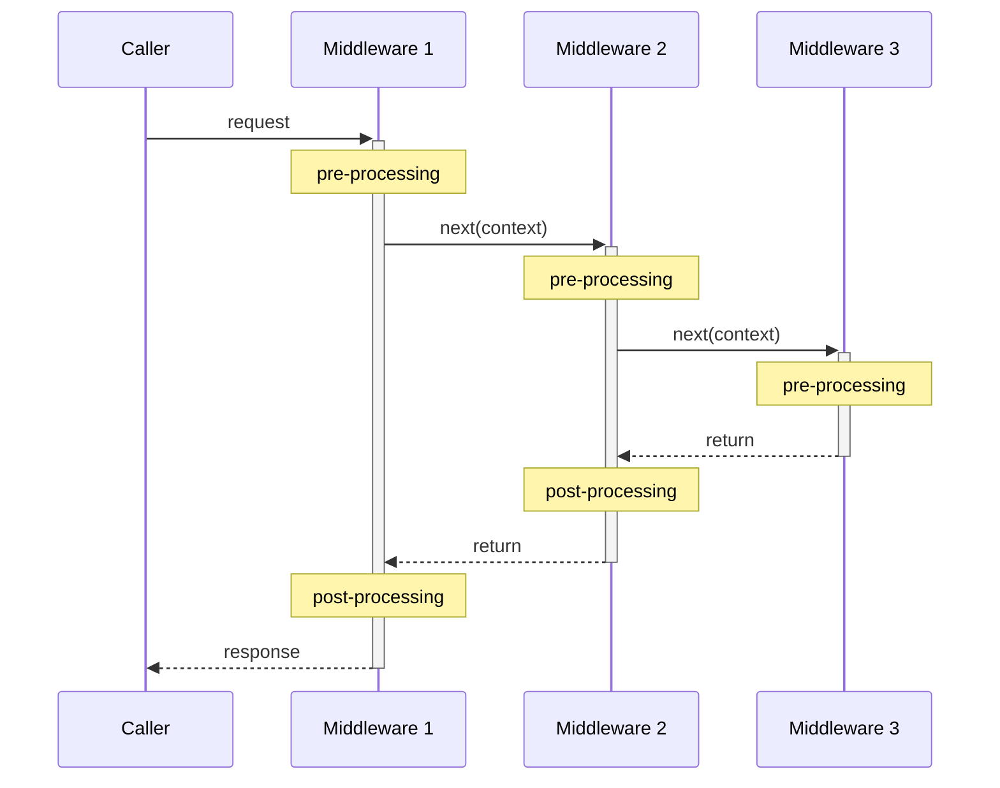

[](https://github.com/marklauter/plumber/actions/workflows/dotnet.tests.yml)
[](https://github.com/marklauter/plumber/actions/workflows/dotnet.publish.yml)
[](https://www.nuget.org/packages/MSL.Plumber.Pipeline/)
[](https://dotnet.microsoft.com/en-us/download/dotnet/10.0/)


# Plumber

*Another weapon from the MSL Armory*

## Middleware pipelines for host-free .NET projects

Plumber gives console apps, Lambdas, queue consumers, and other host-free .NET projects the same middleware-pipeline shape that ASP.NET Core gives web apps. You define a request type, a response type, and a chain of middleware components. Plumber wires up DI, configuration, logging, scoping, timeouts, and cancellation; you focus on the steps in your pipeline.

> **Upgrading from v2.x?** Many APIs changed in v3 — interfaces removed, configuration no longer auto-loaded, builder reshaped. See [Migration v2.x → v3.x](#migration-v2x--v3x) at the bottom. v3 is also a modernization and bug-fix pass: faster middleware dispatch (expression-tree-compiled), monotonic `Elapsed`, distinguishable timeout exceptions, and a host-mode factory for reusing an existing DI container.

## Table of Contents
- [Plumber](#plumber)
  - [Middleware pipelines for host-free .NET projects](#middleware-pipelines-for-host-free-net-projects)
  - [Table of Contents](#table-of-contents)
  - [When to reach for Plumber](#when-to-reach-for-plumber)
  - [Installation](#installation)
  - [Hello, World](#hello-world)
  - [Pipeline architecture](#pipeline-architecture)
  - [Building a pipeline](#building-a-pipeline)
    - [Configuration sources](#configuration-sources)
    - [Service registration](#service-registration)
    - [Logging](#logging)
  - [Middleware](#middleware)
    - [Delegate middleware](#delegate-middleware)
    - [Class middleware](#class-middleware)
      - [Method injection (recommended)](#method-injection-recommended)
      - [Constructor injection (advanced — singleton lifetime, root provider)](#constructor-injection-advanced--singleton-lifetime-root-provider)
  - [Request lifecycle](#request-lifecycle)
    - [Sharing data between middleware](#sharing-data-between-middleware)
    - [Short-circuiting](#short-circuiting)
    - [Pipelines with no response: `Unit`](#pipelines-with-no-response-unit)
    - [Timeouts](#timeouts)
    - [Error handling](#error-handling)
  - [Testing your pipeline (preview)](#testing-your-pipeline-preview)
    - [Asserting pipeline composition](#asserting-pipeline-composition)
  - [Sample app](#sample-app)
  - [Advanced](#advanced)
    - [Hosting inside an existing DI container](#hosting-inside-an-existing-di-container)
    - [Multiple `Build()` calls](#multiple-build-calls)
    - [Custom `TimeProvider` for tests](#custom-timeprovider-for-tests)
  - [FAQ](#faq)
  - [Migration v2.x → v3.x](#migration-v2x--v3x)
    - [1. Interfaces removed](#1-interfaces-removed)
    - [2. `Void` → `Unit`](#2-void--unit)
    - [3. Configuration is no longer auto-loaded](#3-configuration-is-no-longer-auto-loaded)
    - [4. `Services` and `Configuration` properties → callbacks](#4-services-and-configuration-properties--callbacks)
    - [5. Scoped or transient services in middleware ctors → method injection](#5-scoped-or-transient-services-in-middleware-ctors--method-injection)
    - [6. Timeout exceptions are distinguishable](#6-timeout-exceptions-are-distinguishable)
    - [7. Handler is `IDisposable`](#7-handler-is-idisposable)

## When to reach for Plumber
- Console apps and CLI tools that need ordered, composable steps with DI and config
- AWS Lambda functions (API Gateway requests, SQS/SNS events, DynamoDB Streams, EventBridge)
- Queue consumers (RabbitMQ, Kafka, Azure Service Bus)
- File and ETL processors
- Any pipeline you'd reach for ASP.NET Core middleware in, but without the web host

If your project already has a host (ASP.NET Core, generic host, etc.), you usually don't need Plumber — but you can still use it inside an existing DI container; see [Hosting inside an existing DI container](#hosting-inside-an-existing-di-container).

The pipeline shape is borrowed from Steve Gordon's walkthrough of the ASP.NET Core middleware pipeline: [How is the ASP.NET Core Middleware Pipeline Built](https://www.stevejgordon.co.uk/how-is-the-asp-net-core-middleware-pipeline-built). If you're new to middleware, Microsoft also has a [primer in their docs](https://learn.microsoft.com/en-us/aspnet/core/fundamentals/middleware/?view=aspnetcore-10.0).

## Installation
```bash
dotnet add package MSL.Plumber.Pipeline
```
Plumber targets .NET 10. Older targets are not supported in v3.

## Hello, World
The smallest working pipeline:
```csharp
using Plumber;

using var handler = RequestHandlerBuilder
    .Create<string, string>()
    .Build();

handler.Use((context, next) =>
{
    context.Response = $"Hello, {context.Request}!";
    return next(context);
});

var greeting = await handler.InvokeAsync("World");
Console.WriteLine(greeting); // Hello, World!
```

That's the whole shape: a builder, a built handler, one or more middleware, and an `InvokeAsync` call. Each invocation gets its own DI scope and cancellation token.

`RequestHandler<TRequest, TResponse>` is `IDisposable` — always wrap it in `using` so the service provider it built gets cleaned up.

## Pipeline architecture
Middleware in Plumber forms an onion: code before `await next(context)` runs in registration order, code after runs in reverse. A request travels inward; the response travels outward.


```mermaid
sequenceDiagram
    participant Caller
    participant MW1 as Middleware 1
    participant MW2 as Middleware 2
    participant MW3 as Middleware 3

    Caller->>+MW1: request
    Note over MW1: pre-processing
    MW1->>+MW2: next(context)
    Note over MW2: pre-processing
    MW2->>+MW3: next(context)
    Note over MW3: pre-processing
    MW3-->>-MW2: return
    Note over MW2: post-processing
    MW2-->>-MW1: return
    Note over MW1: post-processing
    MW1-->>-Caller: response
```

Three rules:
1. Middleware runs in the order you register it.
2. Anything before `await next(context)` runs going in. Anything after runs coming back.
3. Don't call `next` and the pipeline short-circuits — useful for validation, caching, and authorization.

## Building a pipeline
A typical Plumber pipeline has two halves:
1. **Builder configuration** — registers configuration sources, services, and logging.
2. **Pipeline configuration** — adds middleware to the built handler.

Splitting these into two methods makes the pipeline trivial to test (see [Testing your pipeline](#testing-your-pipeline-preview)).

```csharp
internal static class Pipeline
{
    public static RequestHandlerBuilder<MyRequest, MyResponse> CreateBuilder(string[] args) =>
        RequestHandlerBuilder.Create<MyRequest, MyResponse>(args)
            .AddJsonFile("appsettings.json", optional: true)
            .ConfigureLogging(logging => logging.AddConsole())
            .ConfigureServices((services, configuration) =>
            {
                services.AddSingleton<IMyService, MyService>();
            });

    public static RequestHandler<MyRequest, MyResponse> Configure(
        RequestHandler<MyRequest, MyResponse> handler) =>
        handler
            .Use<ValidationMiddleware>()
            .Use<ProcessingMiddleware>();

    public static RequestHandler<MyRequest, MyResponse> Build(string[] args) =>
        Configure(CreateBuilder(args).Build());
}
```

In `Program.cs`:
```csharp
using var handler = Pipeline.Build(args);
var response = await handler.InvokeAsync(request);
```

This is the convention `Sample.Cli` uses. You're welcome to inline everything, but you'll regret it the first time you write a test.

### Configuration sources
v3 configuration is **opt-in**. Nothing is loaded automatically — except command-line args, which are appended last so they always win. Pick the sources you want:

```csharp
RequestHandlerBuilder.Create<TReq, TRes>(args)
    .AddJsonFile("appsettings.json", optional: true)
    .AddJsonFile($"appsettings.{env}.json", optional: true, reloadOnChange: true)
    .AddEnvironmentVariables("MYAPP_")
    .AddInMemoryCollection([
        new("Feature:Enabled", "true"),
    ]);
```

For ad-hoc cases, the existing extension methods on `IConfigurationBuilder` are available via a callback:
```csharp
builder.ConfigureConfiguration((config, args) =>
{
    config.AddCustomProvider();
});
```

If you want the conventional set (`appsettings.json`, `appsettings.{env}.json`, `DOTNET_*` env vars, all env vars), call:
```csharp
builder.AddDefaultConfigurationSources();
```
User secrets are intentionally excluded — call `AddUserSecrets<T>()` explicitly with a type from your assembly when you want them.

### Service registration
Service registration runs at `Build()` time and gets the built `IConfiguration` so you can bind options or pick implementations:
```csharp
builder.ConfigureServices((services, configuration) =>
{
    var options = configuration.GetSection("Tokenizer").Get<TokenizerOptions>()
        ?? TokenizerOptions.Defaults;
    services
        .AddSingleton(options)
        .AddSingleton<ITokenizer, WhitespaceTokenizer>();
});
```

A `TimeProvider` is registered automatically (defaulting to `TimeProvider.System`); register your own if you want to control timer firing in tests — see [Custom `TimeProvider` for tests](#custom-timeprovider-for-tests).

### Logging
Logging is opt-in. If you don't call `ConfigureLogging`, no logging infrastructure is registered.
```csharp
builder.ConfigureLogging(logging =>
{
    logging.SetMinimumLevel(LogLevel.Information);
    logging.AddSimpleConsole(o => o.SingleLine = true);
});
```

## Middleware
Middleware is a piece of work that runs against a `RequestContext<TRequest, TResponse>`. It chooses whether to call `next(context)` (continue) or short-circuit by setting `context.Response` and returning.

### Delegate middleware
For one-off transformations, register an inline delegate:
```csharp
handler.Use(async (context, next) =>
{
    context.ThrowIfCanceled();

    var stopwatch = Stopwatch.StartNew();
    await next(context);
    stopwatch.Stop();

    Console.WriteLine($"{context.Id} took {stopwatch.ElapsedMilliseconds}ms");
});
```

### Class middleware
For middleware with dependencies, write a class. Plumber recognizes it by convention: a constructor whose first parameter is `RequestMiddleware<TRequest, TResponse> next`, and a `public Task InvokeAsync` method whose first parameter is `RequestContext<TRequest, TResponse>`.

```csharp
internal sealed class NormalizeMiddleware(RequestMiddleware<string, TextReport> next)
{
    public Task InvokeAsync(RequestContext<string, TextReport> context)
    {
        context.ThrowIfCanceled();
        context.Data["normalized"] = context.Request.ToLowerInvariant();
        return next(context);
    }
}
```
Register with `handler.Use<NormalizeMiddleware>()`.

The terminal middleware at the end of the pipeline already checks cancellation before invoking, so the explicit `ThrowIfCanceled` calls above are defense-in-depth — useful in long-running middleware that does work before deferring to `next`, but not strictly required for short ones. If you'd rather short-circuit without throwing, check `context.IsCanceled` and set `context.Response` yourself.

#### Method injection (recommended)
You can declare additional `InvokeAsync` parameters. Plumber resolves them from the **per-request scope** on every invocation — this is the safe place for `DbContext`, `HttpClient`, and other scoped or transient services.

```csharp
internal sealed class TokenizeMiddleware(RequestMiddleware<string, TextReport> next)
{
    public Task InvokeAsync(
        RequestContext<string, TextReport> context,  // first param must be the context
        ITokenizer tokenizer)                         // resolved from context.Services on every request
    {
        context.ThrowIfCanceled();
        context.Data["tokens"] = tokenizer.Tokenize(context.Request);
        return next(context);
    }
}
```
The dispatch is compiled to an expression tree once per registration — there's no per-invocation reflection cost.

#### Constructor injection (advanced — singleton lifetime, root provider)
Constructor parameters after `next` are resolved from the **root** `IServiceProvider`, not the per-request scope. Plumber constructs the middleware **once** at registration and reuses that instance for every request — effectively a singleton, regardless of how the dependency is registered.

> **Don't inject scoped or transient services via the constructor.** The captured instance is shared across all requests; you'll get stale data, thread-safety violations, or `ObjectDisposedException` from disposed dependencies. Use method injection on `InvokeAsync` instead.

Constructor injection is appropriate when the dependency is genuinely a singleton — `ILogger<T>`, `TimeProvider`, an options instance bound from configuration:

```csharp
internal sealed class LoggingMiddleware(
    RequestMiddleware<string, TextReport> next,
    ILogger<LoggingMiddleware> logger)
{
    public async Task InvokeAsync(RequestContext<string, TextReport> context)
    {
        logger.LogInformation("processing {Id}", context.Id);
        await next(context);
        logger.LogInformation(
            "completed {Id} in {Elapsed}ms",
            context.Id,
            context.Elapsed.TotalMilliseconds);
    }
}
```

You can also pass extra constructor arguments at registration. Declare the constructor with `next` first, your extra parameters next, then any DI-resolved dependencies. `ActivatorUtilities` matches the supplied arguments by type before satisfying the rest from the root provider:
```csharp
handler.Use<RetryMiddleware>(3, TimeSpan.FromMilliseconds(200));
```

## Request lifecycle

### Sharing data between middleware
The `RequestContext.Data` dictionary lets middleware pass values down the chain without modifying the request or response:
```csharp
handler.Use((context, next) =>
{
    context.Data["user.id"] = AuthenticateAndExtractUserId(context.Request);
    return next(context);
});

handler.Use((context, next) =>
{
    if (context.TryGetValue<string>("user.id", out var userId))
    {
        // ...
    }
    return next(context);
});
```
`TryGetValue<T>` returns `false` for missing keys, null values, and type mismatches — you only get `true` when there's a non-null `T` at the key. Note: zero/default values for value types still return `true` — the check is `value is T`, not `value != default`. If you stored `0` for an `int` key, the call returns `true` with `0`.

The dictionary is allocated lazily on first access, so pipelines that don't share data pay no allocation cost.

### Short-circuiting
Don't call `next` and the rest of the pipeline doesn't run. This is the canonical pattern for validation, caching, and authorization:
```csharp
internal sealed class ValidationMiddleware(RequestMiddleware<string, TextReport> next)
{
    public Task InvokeAsync(RequestContext<string, TextReport> context)
    {
        context.ThrowIfCanceled();

        if (string.IsNullOrWhiteSpace(context.Request))
        {
            context.Response = new TextReport(
                Original: context.Request ?? string.Empty,
                Normalized: string.Empty,
                Tokens: [],
                WordCount: 0,
                Elapsed: TimeSpan.Zero,
                ErrorMessage: "input must be non-empty");
            return Task.CompletedTask; // short-circuit: no next() call
        }

        return next(context);
    }
}
```
Middleware registered earlier than this still observes the short-circuit on the way out — code after their own `await next(context)` runs normally with `context.Response` already populated.

### Pipelines with no response: `Unit`
Some pipelines exist purely to do work — event handlers, queue consumers, notifications. `Unit` is Plumber's name for "no meaningful response":

```csharp
public readonly record struct Unit;
```

Use it as `TResponse`:
```csharp
using var handler = RequestHandlerBuilder
    .Create<MessageBatch, Unit>()
    .Build()
    .Use<ValidateMiddleware>()
    .Use<ProcessMiddleware>();

await handler.InvokeAsync(batch);
```
`Unit` is borrowed from F# (`unit`) and Haskell (`()`). It's more expressive than `object?` and keeps every handler typed as `RequestHandler<TRequest, TResponse>`, no separate void shape needed.

### Timeouts
Two timeout layers: the handler has a built-in timeout configured at `Build()`, and callers can layer a deadline of their own with a `CancellationToken`.

Handler-wide:
```csharp
using var handler = builder.Build(TimeSpan.FromSeconds(30));
```

Caller-supplied:
```csharp
using var cts = new CancellationTokenSource(TimeSpan.FromSeconds(10));
var response = await handler.InvokeAsync(request, cts.Token);
```

When the handler timeout elapses, `InvokeAsync` throws `TimeoutException`. When the caller's token cancels, it throws `OperationCanceledException`. If both fire, the caller wins. The parameterless `InvokeAsync(request)` overload skips the caller layer entirely — the handler timeout is the only cancellation signal in flight. The timer is driven by the registered `TimeProvider`, so `FakeTimeProvider` works in tests.

### Error handling
Exceptions propagate through the pipeline by default. Wrap a try/catch at the outer edge if you want to convert or log them:
```csharp
internal sealed class ErrorBoundary<TReq, TRes>(
    RequestMiddleware<TReq, TRes> next,
    ILogger<ErrorBoundary<TReq, TRes>> logger)
    where TReq : notnull
{
    public async Task InvokeAsync(RequestContext<TReq, TRes> context)
    {
        try
        {
            await next(context);
        }
        catch (OperationCanceledException)
        {
            logger.LogWarning("request {Id} was cancelled", context.Id);
            throw;
        }
        catch (TimeoutException)
        {
            logger.LogWarning("request {Id} timed out", context.Id);
            throw;
        }
        catch (Exception ex)
        {
            logger.LogError(ex, "request {Id} failed", context.Id);
            throw;
        }
    }
}
```
Register the boundary first if you want it to see every exception in the pipeline. The class is generic, so spell out the closed generic when you register it:
```csharp
handler.Use<ErrorBoundary<MyRequest, MyResponse>>();
```

## Testing your pipeline (preview)

> **Preview — `Plumber.Testing` is in the source tree but is not yet published to NuGet.** Once published, this becomes the recommended way to test pipelines; until then, take a project reference to `Plumber.Testing` directly.

`Plumber.Testing` ships a `PlumberApplicationFactory<TRequest, TResponse>` modeled on ASP.NET Core's `WebApplicationFactory<TEntryPoint>`. It builds your real pipeline once per test, lets you swap services or configuration, and disposes everything when the test ends.

```csharp
using Plumber.Testing;

public sealed class PipelineTests
{
    [Fact]
    public async Task ValidInputProducesReportAsync()
    {
        using var factory = new PlumberApplicationFactory<string, TextReport>(
            Pipeline.CreateBuilder,
            Pipeline.Configure);

        var report = await factory.InvokeAsync("Hello, World!");

        Assert.NotNull(report);
        Assert.Equal("hello, world!", report.Normalized);
    }

    [Fact]
    public async Task StubTokenizerAsync()
    {
        using var factory = new PlumberApplicationFactory<string, TextReport>(
                Pipeline.CreateBuilder,
                Pipeline.Configure)
            .WithServices(services =>
                services.AddSingleton<ITokenizer>(new StubTokenizer(["a", "b", "c"])));

        var report = await factory.InvokeAsync("anything");

        Assert.Equal(3, report!.WordCount);
    }
}
```

Customization hooks:

| Method | What it does |
|---|---|
| `WithBuilder(Action<RequestHandlerBuilder<TReq,TRes>>)` | Escape hatch — full access to the builder |
| `WithServices(Action<IServiceCollection>)` | Swap or add services |
| `WithServices(Action<IServiceCollection, IConfiguration>)` | Same, with `IConfiguration` available |
| `WithLogging(Action<ILoggingBuilder>)` | Adjust logging |
| `WithConfiguration(Action<IConfigurationBuilder>)` | Add config sources |
| `WithInMemorySettings(IEnumerable<KeyValuePair<string, string?>>)` | Seed config keys |

`CreateHandler()` is idempotent — call it as many times as you like; the same handler comes back. Once it's been called, builder hooks are frozen; trying to add more throws.

### Asserting pipeline composition

`RequestHandler<TRequest, TResponse>.Middleware` exposes one `MiddlewareDescriptor` per registration, in registration order — which is also inbound execution order. Use it to assert that your pipeline is wired in the order you expect, without invoking anything:

```csharp
[Fact]
public void PipelineRegistersMiddlewareInOrder()
{
    using var factory = new PlumberApplicationFactory<string, TextReport>(
        Pipeline.CreateBuilder,
        Pipeline.Configure);

    Assert.Collection(
        factory.CreateHandler().Middleware,
        m => Assert.Equal(typeof(ValidationMiddleware), m.MiddlewareType),
        m => Assert.Equal(typeof(NormalizeMiddleware), m.MiddlewareType),
        m => Assert.Equal(typeof(TokenizeMiddleware), m.MiddlewareType));
}
```

Class-based registrations (`Use<T>()`) carry the middleware type in `MiddlewareType`. Delegate-based registrations have a `null` type; their `DisplayName` is the method name for method groups and `MiddlewareDescriptor.DelegateDisplayName` (`"<delegate>"`) for lambdas, so a lambda slot asserts cleanly:

```csharp
m => Assert.Equal(MiddlewareDescriptor.DelegateDisplayName, m.DisplayName)
```

The descriptors are metadata only: the component delegates and the compiled pipeline stay private.

## Sample app
[`Sample.Cli`](samples/Sample.Cli) is a complete, working version of the same shape. It's a small CLI that reads stdin (or argv), runs it through validation → normalization → tokenization → reporting, and prints the result. The earlier README snippets are simplified for teaching — the sample's middleware add logging and use shared `DataKeys` constants for the `context.Data` keys. It demonstrates:

- The `CreateBuilder` + `Configure` split
- Configuration via `ConfigureConfiguration` and bound configuration POCOs
- DI-registered services (`ITokenizer`)
- Method injection on class middleware
- Structured logging via `ConfigureLogging`
- A timing wrapper that uses `record with` to enrich the response

[`Sample.Cli.Tests`](samples/Sample.Cli.Tests) shows both direct testing of the built pipeline and the `PlumberApplicationFactory` pattern.

## Advanced

### Hosting inside an existing DI container
If your application already has a built `IServiceProvider` — an ASP.NET Core host, a generic host, or any other container — you can build a Plumber handler that **reuses** that provider instead of creating its own:
```csharp
using var handler = RequestHandler
    .Create<MyRequest, MyResponse>(serviceProvider)
    .Use<MyMiddleware1>()
    .Use<MyMiddleware2>();

var response = await handler.InvokeAsync(request);
```
The handler does **not** take ownership: when it's disposed, your provider is left untouched. The provider must support `IServiceScopeFactory` (any provider built from `ServiceCollection.BuildServiceProvider` or a host already does) — Plumber needs it to create the per-request scope.

If a `TimeProvider` is registered in the provider, it's used for `Elapsed` and timeouts; otherwise `TimeProvider.System` is used.

This is the path to take when you want a Plumber pipeline inside an ASP.NET Core minimal API, an existing console app with `IHostBuilder`, or any other context that already owns a DI root.

### Multiple `Build()` calls
A builder is a recipe; each `Build()` produces an independent handler with its own service provider and configuration root. Use this to spin up a fresh handler per test, or to vary the timeout per build:
```csharp
var builder = Pipeline.CreateBuilder(args);
using var fast = builder.Build(TimeSpan.FromSeconds(1));
using var slow = builder.Build(TimeSpan.FromSeconds(60));
```
Both handlers share the same recipe but are independent at runtime.

### Custom `TimeProvider` for tests
The handler resolves `TimeProvider` from the service collection. Register your own to control elapsed time and timer firing in tests:
```csharp
builder.ConfigureServices((services, _) =>
    services.AddSingleton<TimeProvider>(new FakeTimeProvider()));
```
`FakeTimeProvider` lives in `Microsoft.Extensions.TimeProvider.Testing`.

## FAQ

**How does Plumber compare to ASP.NET Core middleware?**
Same shape, different host. Plumber's `RequestContext<TRequest, TResponse>` is the typed analogue of `HttpContext`; the `Use` overloads, the onion execution model, and the per-request DI scope all behave the same way.

**Can I use Plumber alongside ASP.NET Core?**
Yes — see [Hosting inside an existing DI container](#hosting-inside-an-existing-di-container). It's useful when you have a non-HTTP pipeline (a background worker, a queue handler) that should share the host's services.

**My class middleware doesn't run — what's wrong?**
Common causes: an earlier middleware short-circuited (didn't call `next`), an exception was thrown earlier in the pipeline, or your class signature doesn't match the convention. Plumber expects `RequestMiddleware<TReq, TRes> next` as the first constructor parameter (it's passed positionally first) and requires `RequestContext<TReq, TRes>` as the first `InvokeAsync` parameter; the `InvokeAsync` method must be `public` and return a `Task`.

**Why isn't my appsettings.json loaded?**
v3 doesn't auto-load configuration. Call `AddJsonFile("appsettings.json", optional: true)` (or `AddDefaultConfigurationSources()` for the conventional set) explicitly. See [Configuration sources](#configuration-sources).

**Can I add middleware after the pipeline has been invoked?**
No. The first call to `InvokeAsync` builds the pipeline; further `Use` calls throw `InvalidOperationException`. Configure all your middleware before your first invocation.

## Migration v2.x → v3.x

v3 reshapes the public API around concrete types and explicit configuration. The migrations below cover the common cases.

### 1. Interfaces removed
Both `IRequestHandlerBuilder<TRequest, TResponse>` and `IRequestHandler<TRequest, TResponse>` are gone. Type your variables and parameters with the concrete classes instead.
```csharp
// v2
IRequestHandlerBuilder<MyReq, MyRes> builder = RequestHandlerBuilder.Create<MyReq, MyRes>();
IRequestHandler<MyReq, MyRes> handler = builder.Build();
```
```csharp
// v3
RequestHandlerBuilder<MyReq, MyRes> builder = RequestHandlerBuilder.Create<MyReq, MyRes>();
RequestHandler<MyReq, MyRes> handler = builder.Build();
```

### 2. `Void` → `Unit`
The no-response type was renamed:
```csharp
// v2
RequestHandlerBuilder.Create<SqsEvent, Void>();
```
```csharp
// v3
RequestHandlerBuilder.Create<SqsEvent, Unit>();
```

### 3. Configuration is no longer auto-loaded
v2 implicitly added `appsettings.json`, environment variables, and user secrets. v3 doesn't:
```csharp
// v2 — implicit
var builder = RequestHandlerBuilder.Create<TReq, TRes>(args);
```
```csharp
// v3 — explicit; either pick sources individually
var builder = RequestHandlerBuilder.Create<TReq, TRes>(args)
    .AddJsonFile("appsettings.json", optional: true)
    .AddEnvironmentVariables();

// or opt back into the conventional set
var builder = RequestHandlerBuilder.Create<TReq, TRes>(args)
    .AddDefaultConfigurationSources();
```
`AddDefaultConfigurationSources()` does **not** include user secrets — call `AddUserSecrets<T>()` explicitly.

### 4. `Services` and `Configuration` properties → callbacks
The builder no longer exposes mutable `Services` and `Configuration` properties. Use the `Configure*` callbacks; they run at `Build()` time, with the built `IConfiguration` available where appropriate.
```csharp
// v2
var builder = RequestHandlerBuilder.Create<TReq, TRes>();
builder.Services.AddSingleton<IMyService, MyService>();
builder.Configuration.AddInMemoryCollection(...);
```
```csharp
// v3
var builder = RequestHandlerBuilder.Create<TReq, TRes>()
    .AddInMemoryCollection(...)
    .ConfigureServices((services, configuration) =>
    {
        services.AddSingleton<IMyService, MyService>();
    });
```

### 5. Scoped or transient services in middleware ctors → method injection
v2 let you inject anything into a middleware constructor. v3 still does, but the constructor parameters are resolved from the **root** provider, and the middleware itself is constructed **once** at registration time. Constructor injection of scoped or transient services is now a footgun — use method injection on `InvokeAsync` instead.
```csharp
// v2 — works, but the DbContext is captured in the singleton middleware
internal sealed class SaveMiddleware(
    RequestMiddleware<TReq, TRes> next,
    AppDbContext db)
{
    public async Task InvokeAsync(RequestContext<TReq, TRes> context)
    {
        await db.SaveAsync(context.Request);
        await next(context);
    }
}
```
```csharp
// v3 — DbContext is resolved fresh from the per-request scope
internal sealed class SaveMiddleware(RequestMiddleware<TReq, TRes> next)
{
    public async Task InvokeAsync(
        RequestContext<TReq, TRes> context,
        AppDbContext db)
    {
        await db.SaveAsync(context.Request);
        await next(context);
    }
}
```

### 6. Timeout exceptions are distinguishable
v2 surfaced both handler timeouts and caller cancellation as `OperationCanceledException`. v3 throws `TimeoutException` for handler timeouts and `OperationCanceledException` for caller cancellation. Update any catch clauses that distinguished them by message:
```csharp
// v2
catch (OperationCanceledException ex)
{
    if (ex.Message.Contains("timeout")) { /* ... */ }
}
```
```csharp
// v3
catch (TimeoutException) { /* handler timeout */ }
catch (OperationCanceledException) { /* caller cancellation */ }
```

### 7. Handler is `IDisposable`
Always wrap the handler in `using`. The handler owns the service provider it built — leaking it leaks the provider, any file watchers the configuration registered (e.g. `AddJsonFile(..., reloadOnChange: true)`), and any `IDisposable` services.
```csharp
// v2
var handler = builder.Build();
var response = await handler.InvokeAsync(request);
```
```csharp
// v3
using var handler = builder.Build();
var response = await handler.InvokeAsync(request);
```
The exception is host-mode handlers built via `RequestHandler.Create(IServiceProvider)` — those don't own the provider and don't dispose it; the wrapping `using` only marks the handler itself disposed.
